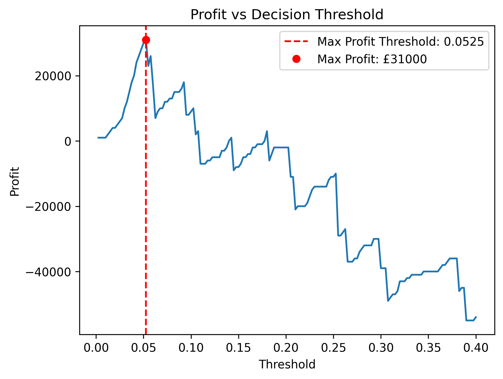

# Credit Risk Analysis & Threshold Optimisation

This project explores credit risk modelling using the German Credit Dataset, with a focus on how model outputs can support real-world lending decisions.

The analysis incorporates a profit-based framework, demonstrating that optimal decisions depend on business costs rather than model accuracy alone.

## Objectives
- Build and evaluate classification models for credit risk
- Compare the performance of different models
- Interpret model outputs and key drivers of default risk
- Analyse the impact of changing classification thresholds
- Optimise decision-making using a profit-based framework

## Dataset
This project uses the German Credit Dataset, which contains borrower characteristics including:
- Credit history
- Loan purpose
- Credit amount
- Employment status

The target variable is recoded as:
- 0 = Non-default
- 1 = Default

## Key Insights
- Logistic regression outperforms the decision tree across key evaluation metrics
- Model calibration is essential for decision-making
- Accuracy alone is not sufficient in a risk setting
- Optimal decisions depend on cost structure
- Lower thresholds can be optimal when defaults are costly 
